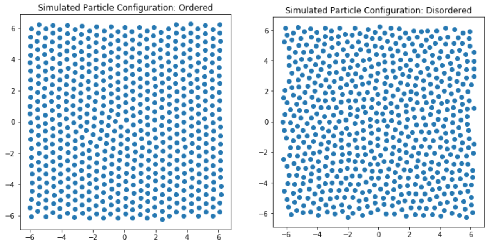

# Classifying Phase transitions

How well can computers identify phases of matter? This is a first step in my exploration of this subject.  A simple neural network is constructed to attempt classification between liquid and crystalline phases from simulated configurations of interacting dipoles.

